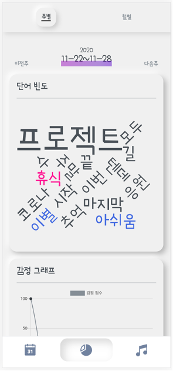

# 오늘 하루

나만의 일기를 작성할 수 있는 공간을 제공하고, 그 내용을 바탕으로 그날의 감정을 분석해서 하루를 마무리할 수 있는 음악을 추천해주는 ***감정관리 모바일 일기 서비스*** 입니다.

 👈 바로가기

- 목차

  1. [주요 기능](#주요-기능)
  2. [기술 스택](#기술-스택)
  3. [시스템 구성](#시스템-구성)
     1. [화면 구성](#화면-구성)
     2. [ERD](#erd)
     3. [아키텍쳐 ](#architecture)

## 주요 기능

**오늘 하루**의 주요 기능 설명입니다.

### 1. PWA

- PWA를 사용해 사용자의 접근성을 향상시켰습니다. 📲

### 2. 카카오 로그인

- 카카오 로그인을 사용해 가입, 로그인이 간편합니다. 

### 3. 일기 작성

- 일기 작성 시 함께 남기고 싶은 이미지를 함께 저장할 수 있습니다. 
- 이미지를 첨부하면, 제공되는 스티커를 이용해 꾸밀 수 있습니다. 
- 작성 전 내용과 스티커를 이용해 그날의 감정을 분석하고, 음악을 추천해 줍니다. 

- 작성페이지에서 🎵 아이콘을 이용해 YouTube에서 원하는 음악을 넣을 수 도 있습니다. 

### 4. 분석

- 분석 페이지에서는 내가 작성한 일기에 대한 분석결과를 볼 수 있습니다. 🔖
- 워드클라우드를 이용해 자주 사용하는 단어에 대해 한눈에 알 수 있습니다. ☁︎

- 그래프를 통해 주별/월별 내 감정의 변화를 한눈에 알 수 있습니다. 📈

## 기술 스택

- ### Back-end
  -  **Python 3.6**
  -  **Django 2.2**
  -  **MySQL 8.0**
  -   **Redis**
  -  **Mecab 형태소 분석**

- ### Front-end

  -  **Vue.js 2.6**
  -  **Konva.js**

## 시스템 구성

- ### 화면 구성

  #### 1. 메인

   

  #### 2. 일기 작성/조회

    

  #### 3. 음악 플레이어

   

  #### 4. 분석

   

  

- ### ERD

  

  

- ### Architecture

  

  

